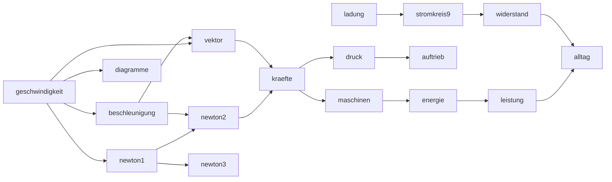

# Unterrichtsplan Physik – Klasse 9 (Mechanik · Druck · Elektrizität)

Plan zur **Abnahme**. Danach baue ich die interaktive Roadmap und die einzelnen Stunden
(+ Arbeitsblätter). Aufbau wie beim Klasse-8-Plan.

Grundlage: schulinterner Lehrplan / Kernlehrplan Physik SI G9 (NRW), Jahrgangsstufe 9.
**Astronomie ist Klasse 8** und kommt hier nicht vor. Klasse 9 = **IF 7 Bewegung/Kraft/
Energie**, **IF 8 Druck & Auftrieb**, **IF 9 Elektrizität**.

Klasse 9 ist stärker **rechnerisch und diagrammbasiert** als die Optik. Prinzip bleibt:
**Präsentation zeigt „Wie mache ich das?"** (Diagramm auswerten, Kräfte addieren, Hebel
rechnen), **auf dem Arbeitsblatt üben die SuS** – hier mit klarem Rechen-/Diagrammfokus.

**Festgelegte Konventionen:**
- **Ortsfaktor g = 10 N/kg** durchgängig in allen Rechnungen.
- **Vektorrechnung ist eine frühe Grundlage.** Größen mit Betrag und Richtung werden schon
  bei der Geschwindigkeit als Vektorpfeile eingeführt; bei den Kräften wird die Addition
  **vor allem rechnerisch** behandelt (Zerlegung in Komponenten, Betrag über Pythagoras,
  Richtung) – das Kräfteparallelogramm dient zur Veranschaulichung/Kontrolle.
- **Reihenfolge:** strikt 9.1 → 9.6 wie im schulinternen Lehrplan.

---

## 1. Roadmap Klasse 9 (Knoten und Abhängigkeiten)

17 Bausteine in drei Inhaltsfeldern. Zwei Einstiegspunkte ohne Voraussetzung
(`geschwindigkeit`, `ladung`). Der Mechanik-Einstieg ist in drei eigene Stunden zerlegt:
**Geschwindigkeit** (Konzept: Größe pro Zeit), **s-t-Diagramme** (eigenes Lernziel, auch
nicht gleichförmig) und **Einheitenumrechnung** (m/s ↔ km/h, Übungsstunde). Danach die drei
Newton-Gesetze und die Vektorrechnung als eigene Bausteine; am Ende laufen mechanische
Leistung und Elektrik im Abschluss-Baustein `alltag` zusammen.



| id | Titel | IF | braucht | Schwerpunkte |
|----|-------|----|---------|--------------|
| groessen-einheiten | Größen & Einheiten | Mathe · 7 | – | Formelzeichen vs. Einheit, Größe = Zahlenwert · Einheit, s (Strecke, kursiv) vs. s (Sekunde, aufrecht), Doppelgänger m/t, Schreibweise |
| geschwindigkeit | Geschwindigkeit | 7 | groessen-einheiten | gleichförmige Bewegung, v = s/t, s-t- und v-t-Diagramm, Vektor (Betrag + Richtung) |
| diagramme | s-t-Diagramme | 7 | geschwindigkeit | Bewegung als Kurve lesen, Steigung = v, gerade/gekrümmt (nicht gleichförmig) |
| beschleunigung | Beschleunigung | 7 | geschwindigkeit | Geschwindigkeitsänderung, a = Δv/Δt, v-t-Diagramm, freier Fall (qualitativ) |
| newton1 | Newton 1: Trägheit | 7 | geschwindigkeit | Ohne Kraft keine Bewegungsänderung, Trägheitsgesetz |
| newton2 | Newton 2: F = m·a | 7 | newton1, beschleunigung | Kraftgesetz, größere Kraft → größere Beschleunigung |
| newton3 | Newton 3: Wechselwirkung | 7 | newton1 | actio = reactio, Kraft und Gegenkraft |
| vektor | Vektorrechnung | Mathe · 7 | geschwindigkeit, beschleunigung | Betrag + Richtung, Pfeile zerlegen/addieren, Geschwindigkeit & Beschleunigung als Vektoren |
| kraefte | Kräfte zusammensetzen | 7 | newton2, vektor | Gewichtskraft F = m·g, Vektoraddition (rechnerisch), Reibung, Gleichgewicht |
| maschinen | Einfache Maschinen | 7 | kraefte | Goldene Regel, Hebelgesetz, feste/lose Rolle, Flaschenzug, schiefe Ebene |
| energie | Energie | 7 | maschinen | Lage-, Bewegungs-, Spannenergie, W = F·s, Umwandlung, Energieerhaltung |
| leistung | Leistung | 7 | energie | P = W/t, Wirkungsgrad (qualitativ), Energieentwertung |
| druck | Druck | 8 | kraefte | p = F/A, Schweredruck, Luftdruck, Dichte, Teilchenmodell |
| auftrieb | Auftrieb | 8 | druck | Auftriebskraft, Archimedisches Prinzip, Schwimmen/Schweben/Sinken |
| ladung | Elektrostatik | 9 | – | Ladungen +/−, Reibungselektrizität, elektrisches Feld/Feldlinien, Spannung, Blitz |
| stromkreis9 | Strom im Teilchenmodell | 9 | ladung | Elektronen-Atomrumpf-Modell, Ladungstransport, U und I als Größen, Messen |
| widerstand | Widerstand & Schaltungen | 9 | stromkreis9 | R = U/I, Reihen-/Parallelschaltung, Sicherungen, el. Energie & Leistung P = U·I |
| alltag | Leistung & Physik im Alltag | 7 · 9 | leistung, widerstand | elektrische Leistung P = U·I, Energiekosten, Wirkungsgrad, Physik im Alltag bewerten |

`ladung` → `stromkreis9` → `widerstand` bauen auf der **Klasse-6-Elektrizität** auf
(dort qualitativ: Stromkreis, Leiter/Isolator, Stromstärke). Klasse 9 macht daraus die
quantitative Behandlung (U, I, R, P) und ergänzt die Elektrostatik.

---

## 2. Technische Umsetzung

Wie in Klasse 6/8: **Präsentationen** über die Lesson-Engine, **Arbeitsblätter** in LaTeX
mit `arbeitsblatt.sty`.

```
Physik/Klasse-9/Mechanik/       _common.js + topics/*.js   (geschwindigkeit … leistung)
Physik/Klasse-9/Druck/          _common.js + topics/*.js   (druck, auftrieb)
Physik/Klasse-9/Elektrik/       _common.js + topics/*.js   (ladung, stromkreis9, widerstand)
Physik/Klasse-9/<bereich>/blaetter/<name>/<name>.tex
```

Neue wiederverwendbare Bausteine (S/W-tauglich für Blätter, farbig am Bildschirm):
- **Diagramm-Helfer**: s-t- und v-t-Diagramme (Achsen, Raster, Messpunkte, Geraden/Flächen)
  – für Präsentation (Canvas) und Blatt (pgfplots, gibt es schon).
- **Kraftpfeile & Kräfteparallelogramm**: Vektor mit Betrag/Richtung, Addition grafisch.
- **Hebel/Rolle/Flaschenzug**: schematische Zeichnungen mit Lasten und Kräften.
- **Schaltungen (quantitativ)**: aus der Klasse-6-`_common.js` (Schaltzeichen, Messgeräte)
  wiederverwendet, ergänzt um U/I/R-Anzeigen und Reihen/Parallel.

---

## 3. Stundenplan pro Roadmap-Knoten

„P:" = was die Präsentation zeigt, „AB:" = Arbeitsblatt. Schätzung gesamt: **~40 Stunden**.

### IF 7 – Bewegung, Kraft und Energie

**geschwindigkeit** (9.1) · 1 Std — Konzept „Änderungsrate pro Zeit"
- P: „schnell" = viel pro Zeit; verschiedene Geschwindigkeitsarten (Weg-, Winkel-,
  Schmelz-, Einnahmegeschwindigkeit) → gemeinsame Idee „Größe pro Zeit"; gleichförmige
  Bewegung; v = s/t.
- AB **„v = s/t"** (Rechnen, Sachaufgaben).

**diagramme** (s-t-Diagramme) · 1–2 Std — eigenes Lernziel
- P: Bewegung als Kurve lesen; waagerecht = steht, Gerade = gleichförmig (steiler =
  schneller); Steigung = Geschwindigkeit; gekrümmt = nicht gleichförmig; ganze Fahrt
  (hin / Pause / zurück).
- AB **„Bewegungsdiagramme"** (lesen und zeichnen, auch nicht gleichförmig).

**einheiten** (m/s ↔ km/h) · 1 Std — Übungsstunde
- P: warum · 3,6 (3600 s ÷ 1000 m); Rechenschritte in beide Richtungen; viele Umrechenübungen.
- AB **„Einheiten umrechnen"** (m/s ↔ km/h, gemischt).

**beschleunigung** (9.1) · 2 Std
- B1 Schneller werden · P: Geschwindigkeitsänderung, a = Δv/Δt, Einheit m/s².
- B2 Beschleunigung im v-t-Diagramm · P: Gerade im v-t-Diagramm, Fläche = Strecke, freier Fall (qualitativ).
- AB **„Beschleunigung rechnen & auswerten"** (a bestimmen, v-t-Diagramme).

**vektor** (Vektorrechnung) · 3 Std — nach den Konzepten, vor den Kräften
- V1 Vektoren: Betrag und Richtung · P: ein Vektor ist ein Pfeil mit Länge und Richtung; Abgrenzung zu reinen Zahlen.
- V2 Zerlegen & Addieren · P: Vektor in Komponenten (x/y) zerlegen; Vektoren rechnerisch und grafisch addieren; Betrag über Pythagoras.
- V3 Geschwindigkeit & Beschleunigung als Vektoren · P: v und a bekommen eine Richtung; Bewegung in zwei Richtungen (z. B. Wurf, Strömung).
- AB **„Vektoren zeichnen & rechnen"** (zerlegen, addieren, Betrag und Richtung).

**Die drei Newton-Gesetze** (9.2) · 3 Std — jeweils eigener Baustein
- N1 Newton 1: Trägheit · P: Ohne Kraft keine Bewegungsänderung; ein Körper behält Tempo und Richtung (Trägheitsgesetz). Kraftpfeil (Angriffspunkt, Betrag, Richtung).
- N2 Newton 2: F = m·a · P: Kraftgesetz – größere Kraft bewirkt größere Beschleunigung; Zusammenhang von Kraft, Masse und Beschleunigung.
- N3 Newton 3: Wechselwirkung · P: actio = reactio, Kraft und Gegenkraft.
- AB **„Kräfte darstellen"** (Kraftpfeile zeichnen, actio/reactio erkennen).
- AB **„F = m·a"** (Grundgleichung rechnen, Einheiten).

**kraefte** (9.2) · 4 Std
- KA1 Gewichtskraft & Masse · P: F = m·g (g = 10 N/kg), Unterschied Masse/Gewicht, Federkraftmesser.
- KA2 Kräfte als Vektoren · P: Kraftpfeil mit Betrag + Richtung, Zerlegung in Komponenten (x/y).
- KA3 Kräfte rechnerisch addieren · P: Komponenten addieren, Betrag über Pythagoras, Richtung;
  Kräfteparallelogramm zur Kontrolle; Kräftegleichgewicht.
- KA4 Reibung · P: Haft-/Gleitreibung, Nutzen und Schaden.
- AB **„Gewichtskraft F = m·g"** (Rechnen).
- AB **„Kräfte als Vektoren addieren"** (rechnerisch: Komponenten, Betrag/Richtung; Parallelogramm zur Kontrolle).

**maschinen** (9.2) · 3 Std
- M1 Goldene Regel & Hebel · P: Kraft sparen = Weg zusetzen; Hebelgesetz F₁·l₁ = F₂·l₂.
- M2 Rolle & Flaschenzug · P: feste/lose Rolle, Flaschenzug (n Seile → Kraft/n, Weg·n).
- M3 Schiefe Ebene · P: Kraft entlang der Ebene, Kraft-Weg-Bilanz.
- AB **„Hebelgesetz"** (Rechnen, Gleichgewicht).
- AB **„Flaschenzug & schiefe Ebene"** (Goldene Regel anwenden, rechnen).

**energie** (9.3) · 3 Std
- E1 Energieformen · P: Lage-, Bewegungs-, Spannenergie; W = F·s (Hubarbeit).
- E2 Umwandlung & Erhaltung · P: Energieumwandlungsketten, Energieerhaltung, Energieentwertung durch Reibung.
- E3 Rechnen mit Energie · P: E_lage = m·g·h, E_kin = ½·m·v², Bilanz (z. B. Fall/Pendel).
- AB **„Energie berechnen"** (Lage-/Bewegungsenergie, W = F·s).
- AB **„Energieerhaltung"** (Umwandlungsketten, Bilanzaufgaben).

**leistung** (9.3) · 2 Std
- L1 Leistung · P: P = W/t, Einheit Watt, Alltagsbeispiele.
- L2 Wirkungsgrad · P: nutzbare vs. zugeführte Energie, Entwertung (qualitativ + einfache Rechnung).
- AB **„Leistung P = W/t"** (Rechnen, Vergleich).

### IF 8 – Druck & Auftrieb

**druck** (9.4) · 3 Std
- D1 Druck = Kraft pro Fläche · P: p = F/A, Einheit Pascal, warum spitz/breit wirkt.
- D2 Druck in Flüssigkeiten & Gasen · P: Schweredruck p = ρ·g·h, Luftdruck, Teilchenmodell.
- D3 Dichte · P: ρ = m/V, Zusammenhang mit Schweredruck.
- AB **„Druck p = F/A"** (Rechnen, Alltag).
- AB **„Schweredruck & Dichte"** (ρ·g·h, ρ = m/V).

**auftrieb** (9.4) · 2 Std
- A1 Auftrieb · P: Auftriebskraft, warum Dinge leichter wirken, verdrängtes Volumen.
- A2 Archimedes · P: F_A = ρ_Fl·g·V, Schwimmen/Schweben/Sinken.
- AB **„Auftrieb & Archimedes"** (F_A rechnen, schwimmt/sinkt entscheiden).

### IF 9 – Elektrizität

**ladung** (9.5) · 3 Std
- Q1 Elektrische Ladung · P: +/− Ladungen, Reibungselektrizität, Anziehen/Abstoßen.
- Q2 Elektrisches Feld · P: Feldlinienmodell, Kraft ohne Berührung.
- Q3 Spannung & Blitz · P: Spannung als „Antrieb", Ladungstrennung, Gewitter/Blitz.
- AB **„Ladung & Feld"** (qualitativ: Vorgänge erklären, Feldlinien skizzieren).

**stromkreis9** (9.5/9.6) · 3 Std
- S0 Auffrischung Schaltungen · P: die **Schaltungszusammenfassung, die auch in Klasse 10
  genutzt wird**, wiederverwenden (Stromkreis, Schaltzeichen, Stromstärke aus Klasse 6) –
  kompakter Einstieg vor der quantitativen Behandlung.
- S1 Elektronen-Atomrumpf-Modell · P: Metall = feste Atomrümpfe + freie Elektronen, Ladungstransport.
- S2 Stromstärke & Spannung messen · P: I und U als Größen, Amperemeter/Voltmeter richtig anschließen.
- AB **„Messen im Stromkreis"** (Schaltpläne lesen, Messgeräte einzeichnen).

**widerstand** (9.6) · 3 Std
- W1 Widerstand R = U/I · P: Zusammenhang U–I, Kennlinie, Ohmsches Gesetz.
- W2 Reihen- & Parallelschaltung · P: Reihe (I gleich, U teilt sich, R addiert), Parallel (U gleich, I teilt sich); Sicherung.
- W3 Elektrische Leistung & Energie · P: P = U·I, W = P·t, Stromkosten.
- AB **„Widerstand R = U/I"** (Rechnen, Kennlinie auswerten).
- AB **„Reihen- & Parallelschaltung"** (Rechnen – bewusst ohne komplexe Ersatzschaltungen).

### Abschluss (IF 7 · 9)

**alltag** (Zusammenführung) · 2 Std
- Hier laufen die mechanische **Leistung** (P = W/t) und die **Elektrik** zusammen: elektrische
  Leistung **P = U·I** und **W = P·t**.
- AL1 Elektrische Leistung & Energiekosten · P: P = U·I, W = P·t, kWh, Stromrechnung, Wirkungsgrad.
- AL2 Physik im Alltag bewerten · P: Geräte vergleichen, Energie sparen, Entscheidungen begründen
  (Bewertungskompetenz).
- AB **„Elektrische Leistung P = U·I"** (Rechnen, Stromkosten).

---

## 4. Arbeitsblätter – Bauliste

Rechen- und diagrammbetont; jeweils mit Lösungsseite:

1. `v-gleich-s-durch-t`, 2. `bewegungsdiagramme`, 3. `beschleunigung`,
4. `kraefte-darstellen`, 5. `gewichtskraft`, 6. `kraefte-vektoraddition` (rechnerisch + Parallelogramm),
7. `hebelgesetz`, 8. `flaschenzug-schiefe-ebene`,
9. `energie-berechnen`, 10. `energieerhaltung`, 11. `leistung`,
12. `druck`, 13. `schweredruck-dichte`, 14. `auftrieb-archimedes`,
15. `ladung-feld` (eher qualitativ), 16. `messen-stromkreis`,
17. `widerstand`, 18. `reihen-parallel`, 19. `elektrische-leistung`.

---

## 5. Entscheidungen (festgelegt)

- **Kräfteaddition:** vor allem **rechnerisch mit Vektoraddition** (Komponenten, Betrag/
  Richtung); Vektorschreibweise wird früh (bei der Geschwindigkeit) als Grundlage eingeführt.
  Kräfteparallelogramm nur zur Veranschaulichung/Kontrolle.
- **g-Wert:** durchgängig **g = 10 N/kg** (gerundet).
- **E-Lehre-Auffrischung:** eine Auffrischungsstunde über die **Schaltungszusammenfassung,
  die auch in Klasse 10 genutzt wird** (Wiederverwendung), dann quantitativer Einstieg.
- **Reihenfolge:** strikt **9.1 → 9.6** wie im schulinternen Lehrplan.

Damit ist der Plan abnahmereif. Nächster Schritt: interaktive Klasse-9-Roadmap bauen
(wie Klasse 8/10, mit den Layout-Fixes), dann die Stunden + Arbeitsblätter.
